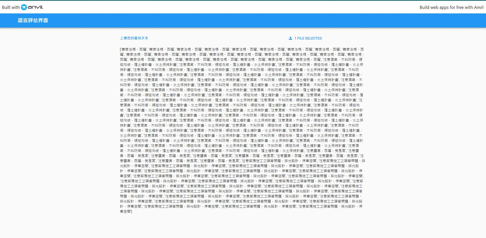

# Site-Classfier-train-model
 

## 模型訓練
Step 1: 你可以直接使用資料，或是根據需求自行調整內容或標籤的文字    
Step 2: 將訓練資料下載後放入Colab Notebooks資料夾（或自行在Colab調整路徑），至Colab開啟訓練檔即可直接執行  
Step 3: 訓練完成後，在該行將測試資料放入Colab Notebooks資料夾（或自行在Colab調整路徑），進行預測  
```
test_df = pd.read_csv("/drive/My Drive/Colab Notebooks/基地環境_test1.csv", 
                      encoding = "utf-8")
test_df = process_contents(test_df)
test_df
label = test_df['標籤']
```
Step 4: 儲存模型請記得有詞彙跟模型兩個檔案(預設路徑至於Colab Notebooks)  

## 介面使用   
下載模型執行檔全部執行後，點擊下方連結使用介面https://b3f7anvovbbtzv4x.anvil.app/MNW7T2KPHMK6PRSVOVEY3H4J
